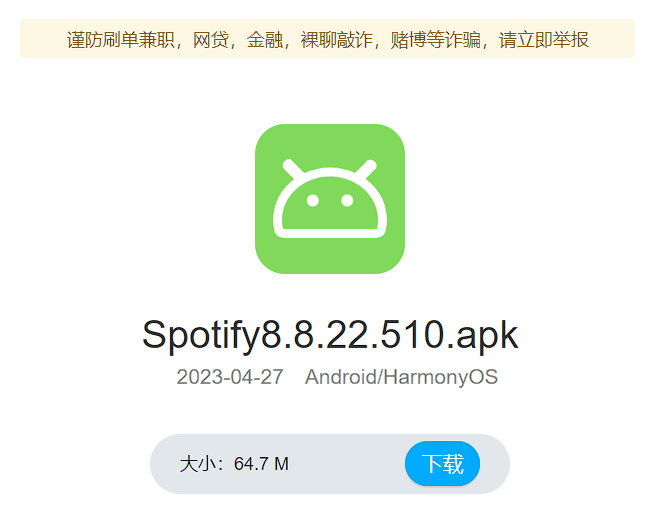
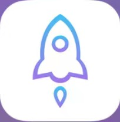

如果你是安卓用户，恭喜你，能够使用破解版免费收听；如果你是苹果用户，也别慌，可以使用免费版，也可像我一样付费充值会员。

## 安卓安装 spotify

点开此[链接](https://wwbz.lanzoue.com/i2moB0u3u8bi)，输入密码 `52`，下载 apk 安装包，安装即可。

## 苹果安装 spotify

首先，你需要有美区 App Store 账号，拥有后，切换 App Store 账号，搜索安装即可。

## 注册 spotify 账号

注册 Spotify 账号需要科学上网能力。

- 安卓用户可以下载 [clash](https://dl.clashforandroid.org/releases/latest/cfa-2.5.12-premium-universal-release.apk)

- 苹果用户可以通过美区账号，付费下载小火箭

- 去机场网站订阅节点，导入即可。
- 恭喜你拥有了科学上网能力，后续只需要去 Spotify 官网，通过邮箱注册账号即可。

## 帮助

本人知晓，拥有美区账号、下载小火箭、订阅节点，都有一定门槛。由于大家都只是为了享受 beatbox 音乐，所以遇到困难的小伙伴可以 qq（2534856393 备注来意）联系我，我将给予帮助。
