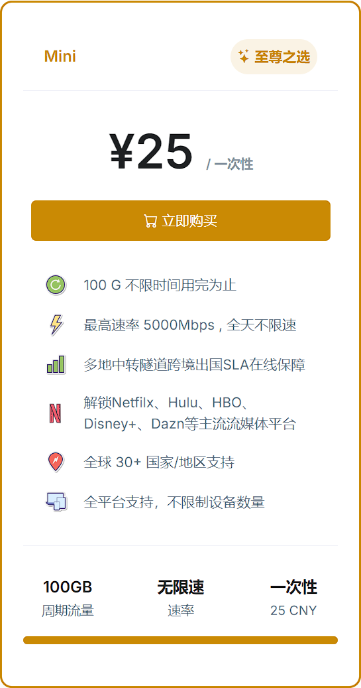

科学上网，仅供交流学习海外资源，切忌发表政治相关言论。

## 安卓用户

- 安卓用户可以下载 [clash](https://dl.clashforandroid.org/releases/latest/cfa-2.5.12-premium-universal-release.apk)

## 苹果用户

- 苹果用户可以通过美区账号，付费下载小火箭
- 我可以提供美区账号，或者淘宝购买账号
- 再者是自己注册美区账号，并充值美元点卡，购买小火箭软件，大约 6 美元

## Win 用户

- Win 用户同样是下载 [clash](https://down.clashcn.com/soft/clashcn.com_Clash.for.Windows.Setup.0.20.39.exe)

## Mac 用户

- Mac 用户同样是下载 [clash](https://down.clashcn.com/soft/clashcn.com_ClashX.dmg)

## 机场推荐

本人用的机场是 efcloud，稳定、价格合适。本人购买的套餐如下图，不限时，平时如果下载需求不大、仅仅刷 ins，可以用 5 个月左右。

使用如下网站进行注册，邮箱注册即可，新用户 8 折优惠：

<https://inv.easyfastcloud.com/#/register?code=L69Oq3YI>

同时，你的注册订阅我会抽取佣金，这不会使你额外付费。看在我辛苦码字教程的份上，抽点佣金不过分吧，是互利互惠的关系。

最后，如果你有任何阻塞的问题，欢迎在群里问我。

peace & love.
