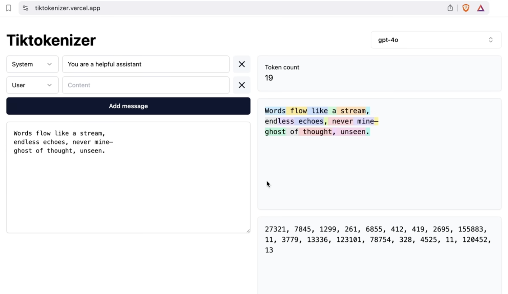
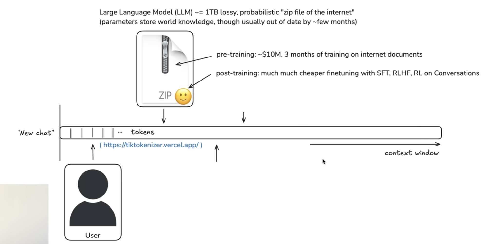
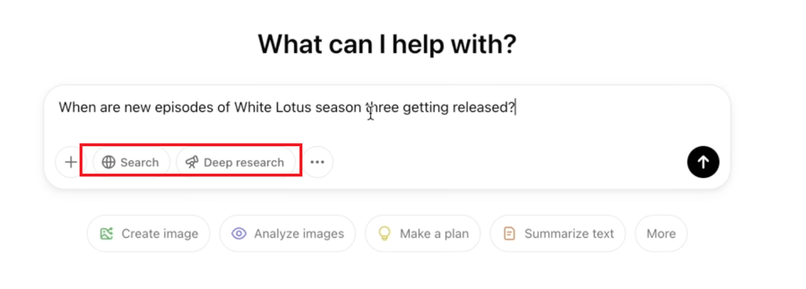
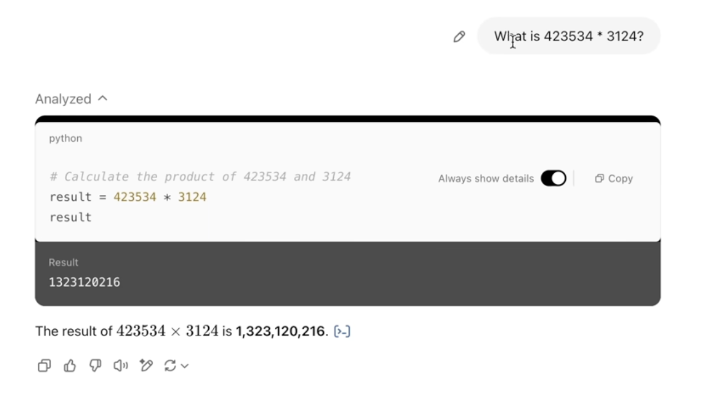
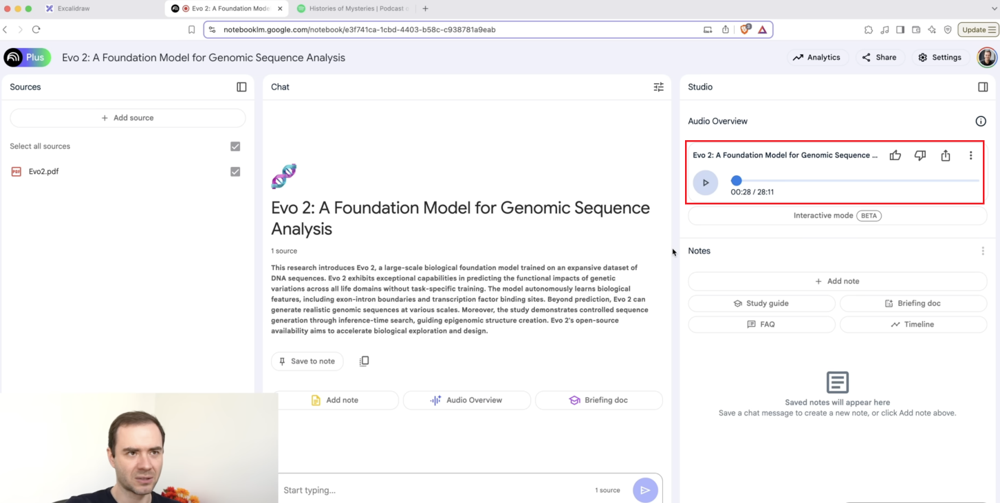
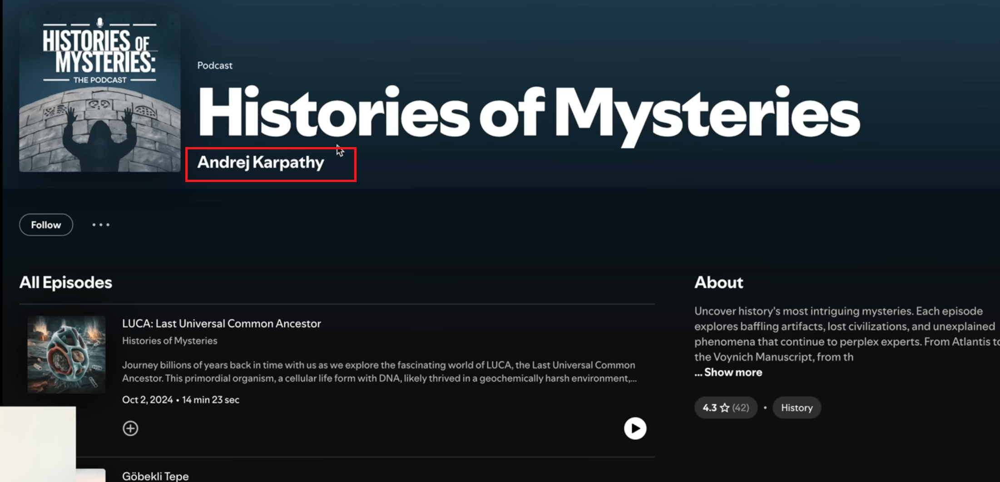
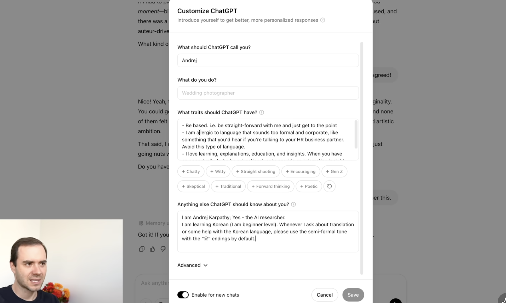
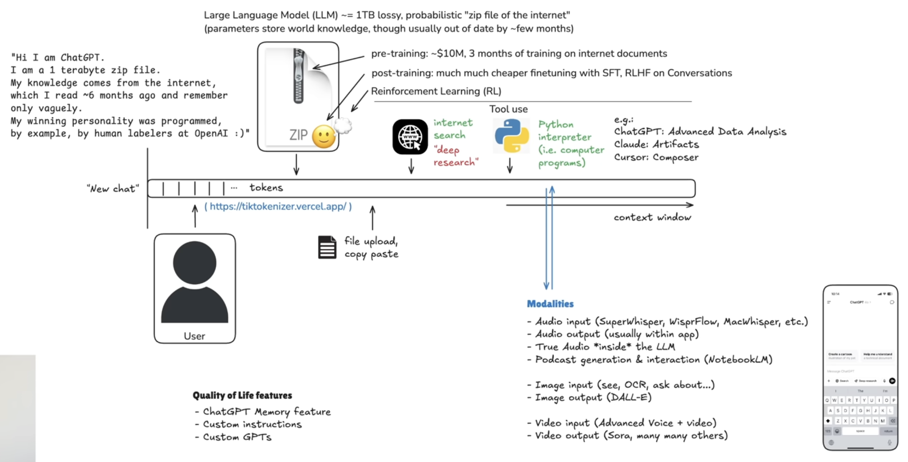

最近看了 Karpathy 在 2025 年 2 月 28 日的一个演讲，视频长达两小时，讲的是他如何使用 AI。这个人之前是 Tesla 的 AI 总监、OpenAI 的创始成员之一，做过 AI 教育，现在在 Anthropic（Claude 的母公司）工作。他这次不是讲怎么训练模型，而是**作为用户，怎么把 AI 用好**。

视频链接：
- [原版（YouTube）](https://www.youtube.com/watch?v=EWvNQjAaOHw)
- [中文翻译（B站）](https://www.bilibili.com/video/BV1y69TYTEUw/)

整个演讲是自底向上的结构，从最基础的对话机制讲到多模态交互，再到他个人的一些实践案例。我把核心内容整理成下面几个部分。

---

## 一、基础概念：Token 和预训练模型

在讲具体使用方法之前，先理解两个基础概念。

### 什么是 Token

**Token（词元）** 是 AI 模型处理文本的基本单位。

简单来说，当你和 AI 对话时，你的输入和 AI 的输出都会被拆分成一个个 token。一个 token 大概相当于：

- 英文：一个单词或单词的一部分（比如 "running" 可能是 "run" + "ning" 两个 token）
- 中文：一个字或一个词

**Token 就像流量**——你用了多少 token，就要付多少钱。所以：

- 输入越长，消耗的 token 越多
- AI 回答越长，消耗的 token 越多
- 上下文窗口越长（历史对话越多），每次调用消耗的 token 越多

这就是为什么要精简提问、定期清空上下文的原因——省钱，也提高效率。

### 什么是预训练模型

AI 模型本质上是一个**压缩包**——把海量的文本、代码、知识压缩成一个包含数十亿甚至数千亿参数的数学模型。

这个"压缩"的过程就是**预训练（Pre-training）**：

- 用几个月时间
- 在成千上万张 GPU 上
- 读取互联网上的海量数据
- 学习语言规律、知识结构、推理模式

预训练完成后，模型就像一个"知识压缩包"，你问它问题，它就从这个压缩包里"解压"出答案。

但这也带来一个问题：**预训练需要几个月，所以模型的知识是过时的**。比如现在是 2026 年 5 月，但模型的知识可能截止到 2025 年底。

这就是为什么需要**联网搜索**和**微调**——让模型能获取最新信息。

---

## 二、上下文窗口：成本和准确性的平衡

### 什么是上下文窗口

 
当你和 ChatGPT 对话时，每一轮的 User 和 Assistant 消息都会累积成一个**上下文窗口（Context Window）**。AI 每次回答你的问题，都要把整个窗口重新读一遍。

这带来两个问题：

1. **成本升高**：窗口越长，每次调用的 token 消耗越大。
2. **准确性下降**：窗口太长容易让模型分心，产生幻觉或混淆信息。

### 实践建议

- **新话题开新窗口**。如果你要聊一个完全不同的主题，别在同一个对话里继续，直接开一个新会话。
- **精简提问**。用简短、明确的语言提问，避免冗长的口水话。这不仅省钱，还能提高回答质量。

举个例子：如果你在用 Claude Code，每次对话都带着几千字的历史记录，不仅响应慢，成本也会指数级上升。该清空上下文就清空（`/clear`），别舍不得。

---

## 三、LLM Council：多模型交叉验证

 
Karpathy 提到一个有趣的习惯：**同一个问题问多个模型**，然后对比答案。

这个方法叫 **LLM Council（大模型委员会）**。不同模型的训练数据、架构、调优方式都不一样，所以对同一个问题的回答角度也会有差异。通过对比，你能：

- 发现某个模型的盲区或偏见
- 找到更全面的答案
- 判断哪个模型更适合你当前的任务

我自己也会这么做，尤其是遇到技术选型或者复杂推理问题的时候。比如同时问 GPT、Claude 和 Gemini，看看它们各自给出什么方案，然后综合判断。

---

## 四、预训练 vs 微调：时效性的权衡

 
### 预训练的局限

AI 模型的**预训练（Pre-training）** 是一个漫长且昂贵的过程，通常需要几个月时间和大量算力。这导致模型的知识截止日期往往是几个月甚至一年前。

### 微调和实时性

为了让模型掌握最新知识，有几种方法：

1. **微调（Fine-tuning）**：在预训练模型的基础上，用新数据做小规模训练。成本比预训练低，但仍然需要时间。
2. **联网搜索**：让模型在回答问题时实时去网上查资料，这是目前解决时效性最直接的方法。

Karpathy 强调，**联网搜索才是让 AI 具备实时性的主要手段**，而不是频繁微调。

---

## 五、深度思考：什么时候需要，什么时候不需要

 
### 强化学习带来的突破

2025 年的一个重要进展是**强化学习（Reinforcement Learning）**在推理阶段的应用，也就是所谓的**深度思考（Deep Thinking）**。

模型在回答之前会进行额外的推理步骤，类似于人在解决复杂问题时的"思考过程"。这对以下场景特别有效：

- 复杂推理
- 数学计算
- 代码编写

### 不要滥用

但 Karpathy 也提醒：**不是所有问题都需要深度思考**。

如果你问的是常识性问题（比如"北京是中国的首都吗？"），开启深度思考只会浪费时间和成本。只有在真正需要推理的场景下，才值得用这个功能。

---

## 六、联网搜索 + Deep Research：对抗幻觉

### 幻觉问题

AI 模型最大的问题之一就是**幻觉（Hallucination）**——它会编造一些听起来很合理但实际上是错的信息。

### 解决方案

- **联网搜索**：让模型在回答时去查实时资料。Perplexity 是最早做这个的，现在大部分 AI 都支持了。
- **Deep Research**：联网搜索 + 深度思考的组合。适合用来：
  - 概括论文
  - 读晦涩难懂的书籍
  - 理解复杂概念

我自己看论文基本都是先让 AI 做个总结，然后针对某个算法或概念定点提问。这比从头到尾自己啃效率高太多。

---

## 七、工具使用：让 AI 写代码而不是硬算

### 直接推理的局限

如果你让 AI 计算一个五位数乘五位数的乘法，它直接推理的话很容易出错，而且耗时。

### 更聪明的方法

给 AI 加上一个**代码解释器**（比如 Python），让它写代码来计算，然后把结果返回给你。这样：

- 更准确
- 更快
- 更省 token

这个思路可以推广到很多场景：数据处理、统计分析、复杂计算，都可以让 AI 写代码来完成，而不是让它硬算。

---

## 八、多模态交互：从文本到语音到视觉

### 语音交互

 
早期的语音交互是**语音转文字 → 文字发给 AI → AI 回复文字 → 文字转语音**。

但现在像 ChatGPT、Grok、豆包这些，已经支持**真实的语音交互**：

- 多种声线
- 不同语气
- 更自然的对话节奏

这让 AI 变得更"人性化"。Karpathy 提到，这也让虚拟伴侣、虚拟女友这种应用变得真实可行——之前看到新闻说有人爱上了 AI，在以前是不敢想的。

### 图片和视频

 
对于图片，Karpathy 的建议是：

1. **先让 AI 转译图片**，获取图片的文字描述。
2. **人工确认无误**。
3. **针对转译后的文本提问**，而不是直接对着图片问。

这样能确保后续回答不会出错。

他举了几个实际例子：

- 解析体检报告
- 分析长寿人群的食谱
- 统计室内二氧化碳浓度

这些都是用 AI 做**个人健康管理**的场景。他很关注自己的健康，我觉得这点值得学习——有了 AI，健康管理的门槛降低了很多。

### Notebook LLM：生成播客

Karpathy 还提到一个有趣的工具：**Google 的 Notebook LLM**。

你给它一段文本、一本书或者一份数据，它能生成一个**播客（Podcast）**。你可以在运动、开车的时候听，挺适合碎片时间学习的。

---

## 九、记忆和自定义指令：构建你的 AI 应用

### 记忆功能

像 Claude Code 这种工具，会从你的对话中慢慢记下一些特征，下次对话时自动遵从这些指令。

记忆的本质就是一个 **Markdown 文档**，也就是一个**预读提示（Pre-read Prompt）**。

### 构建自己的 AI 应用

当你经常用到某段 prompt 的时候，你就可以把它固化下来，构建一个**智能体（Agent）**。

Karpathy 举了个例子：他在学韩语，会让 AI 自动把一段文本解析成**韩语-英语对照**的形式，然后把每个单词单独拎出来解析。

### 关键点

1. **格式化很重要**：让 AI 遵从固定的输入输出格式。
2. **Few-shot 示例**：给几个例子，让 AI 照着做。
3. **定期清理上下文**：随着对话轮次增多，AI 会逐渐偏离指令，需要定期清空。
4. **用结构化语言**：比如 XML，让指令更清晰。

### AI 即底层

这让我想到：**AI 其实是一个底层**。

很多人在上面做 prompt、做 skill、做 instruction，然后构建应用。未来很多传统应用会被替代，因为 AI 都能做——翻译、编码、写作，而且可能更准确、更个性化。

也就是说，**每个人都可以构建自己的应用**。

---

## 十、Skill 通货膨胀：工具之外的思考

 
最近因为 Claude Code CLI 的流行，GitHub 上出现了大量 skill 项目。1K、2K、10K、20K star 的项目已经不足为奇。

这有点像**通货膨胀**——太多行外人涌入这个领域，把 star 当成收藏，有点跟风的意思。

### 我的看法

- **先用起来**。别纠结哪个 skill 最好，先用几个试试。
- **理解背后的思想**。工具会变，但方法论不会。
- **构建自己的 skill**。借鉴别人的，然后在基础上优化，这才是最实在的。

---

## 十一、Agent 时代：生产力的重新分配

 
视频是 2025 年 2 月的，到现在已经一年多了。以我个人的观察，**Agent** 是这段时间最大的变化。

### 什么是 Agent

Agent 能全自动化地控制你的文件系统，做增删改查、输入输出。这极大地改造了人的生产方式，提高了生产力。

但这也**扩大了人与人之间的差距**——因为这种应用需要成本。

### Token 经济

**Token 就像未来的电费或流量**。

一个人能支配的 Token 越多，生产力就越高。那么谁掌控了 Token？

1. **AI 应用层**：OpenAI、Anthropic、国产 AI 公司
2. **算力层**：GPU、NPU 制造商
3. **半导体层**：芯片设计和制造
4. **基础设施层**：网络和电力

### 中国的优势和劣势

- **优势**：电力可控，电费相对便宜
- **劣势**：显卡算力不足，受制于人

这是一个很现实的问题。

---

## 总结

Karpathy 这个演讲的价值在于：**他不是教你怎么训练模型，而是教你怎么用好模型**。

核心要点：

1. **管理上下文**：新话题开新窗口，精简提问
2. **多模型验证**：同一个问题问多个模型
3. **选择性使用深度思考**：复杂推理才用，别滥用
4. **联网搜索对抗幻觉**：实时性和准确性的保障
5. **让 AI 写代码而不是硬算**：工具使用是关键
6. **多模态交互**：语音、图片、视频，各有最佳实践
7. **构建自己的 AI 应用**：记忆 + 自定义指令 + Few-shot
8. **理解工具背后的思想**：别被 skill 通货膨胀迷惑
9. **拥抱 Agent 时代**：生产力格局正在重新分配

最后，**交叉验证永远重要**。AI 会有幻觉，所以涉及代码、文献、数据的时候，人要扮演 reviewer 的角色。

AI 是工具，不是替你思考的东西。你还是要做决策、定方向、判断对错。但它能帮你把"想清楚之后怎么落地"这一段做得又快又好——而这一段，在没有 AI 之前是最耗时间的。

---

**相关阅读**：
- [用 Claude Code 一周的一些心得](/posts/claude-code-tips/)
- [Mac 终端配置：从零到顺手](/posts/mac-terminal-setup/)
